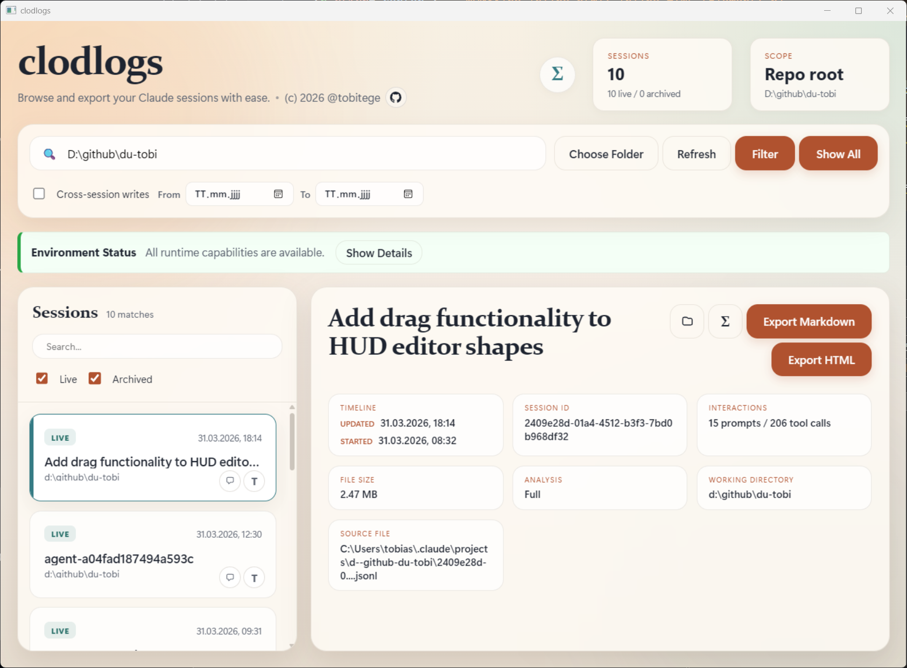
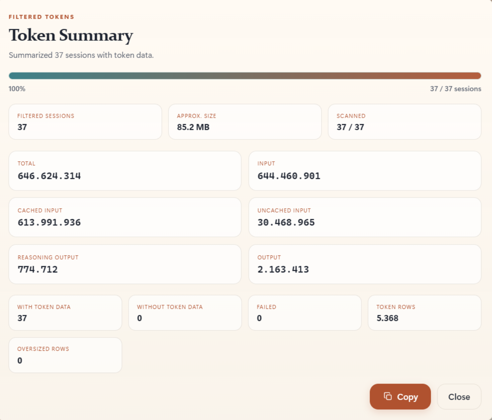

<p align="center">
  
</p>

<p align="center">
  
  
  
  
  
</p>

# clodlogs

`clodlogs` is a Claude Code session-log tool with two entry points:

- a CLI for finding sessions and exporting one `.jsonl` session to Markdown or HTML
- an Electrobun desktop browser for scanning sessions, filtering by folder, and exporting the selected session

This is a port of my Codex logs tool "[codlogs](https://github.com/tobitege/codlogs)" with the same feature set, thus a low commit count for now.

Claude Code stores project logs under:

```text
%USERPROFILE%\.claude\projects\<sanitized-project-path>\*.jsonl
```

For example:

```text
C:\Users\[username]\.claude\projects\c--github-myrepo
```

This repository uses Bun as its development package manager and commits `bun.lock`.
Use `bun install` instead of `npm install` or `pnpm install`.

<p align="center">
  
</p>

<p align="center">
  
</p>

## CLI

Install it globally from this folder:

```powershell
npm install -g c:\github\clodlogs
```

Use either `clodlogs` or `clodlogs-sessions`:

```powershell
clodlogs
clodlogs --json
clodlogs --help
clodlogs c:\github\my-project
clodlogs --claude-home C:\Users\[username]\.claude c:\github\my-project
clodlogs --md C:\Users\[username]\.claude\projects\c--my-project\session.jsonl
clodlogs --html C:\Users\[username]\.claude\projects\c--my-project\session.jsonl
clodlogs --md C:\Users\[username]\.claude\projects\c--my-project\session.jsonl --include-tool-results
```

Notes:

- the folder argument is optional; if omitted, the current working directory is used
- if the folder is inside a git repo, the CLI matches sessions for the repo root by default
- use `--json` to print machine-readable session results
- use `-h` or `--help` to show the built-in CLI help text
- use `--cwd-only` to match only the folder tree you pass in
- use `--claude-home PATH` if your Claude data lives somewhere other than `%CLAUDE_HOME%` or `~/.claude`
- use `--include-tool-results` with `--md` or `--html` to include tool calls and tool outputs in the export
- Windows drive paths, WSL `/mnt/<drive>/...` paths, and WSL UNC paths are treated as aliases of the same repo

## Desktop App

The desktop browser uses [Electrobun](https://electrobun.dev/).

Prerequisites:

- Bun `>=1.3.12`
- Windows 11+ with WebView2 available for the embedded webview runtime

Run it locally:

```powershell
bun install
bun run start
```

For live UI reload while editing:

```powershell
bun run dev:hmr
```

Other useful commands:

```powershell
bun run build:web
bun run build
```

Current desktop app highlights:

- scans Claude project JSONL logs from `~/.claude/projects` or `%CLAUDE_HOME%\projects`
- filters by current folder tree or repo root and can include cross-session writes
- exports the selected session to Markdown or HTML
- summarizes Claude message usage for one selected session or all currently filtered sessions
- shows environment status for Claude home access, `git`, and `rg`
- opens a read-only full-window session replay dialog

## Large Session Handling

clodlogs is built to stay usable when a Claude session file becomes very large.

Current behavior:

- probes session file size without loading the whole file into memory
- uses bounded JSONL scanning for browsing and detail inspection
- skips automatic deep analysis for very large sessions to keep the UI responsive
- offers `Analyze Anyway` for a bounded manual scan when automatic analysis is skipped
- treats oversized JSONL rows as partial-analysis conditions instead of crashing normal inspection
- streams Markdown and HTML export so large session files do not require whole-file reads during export
