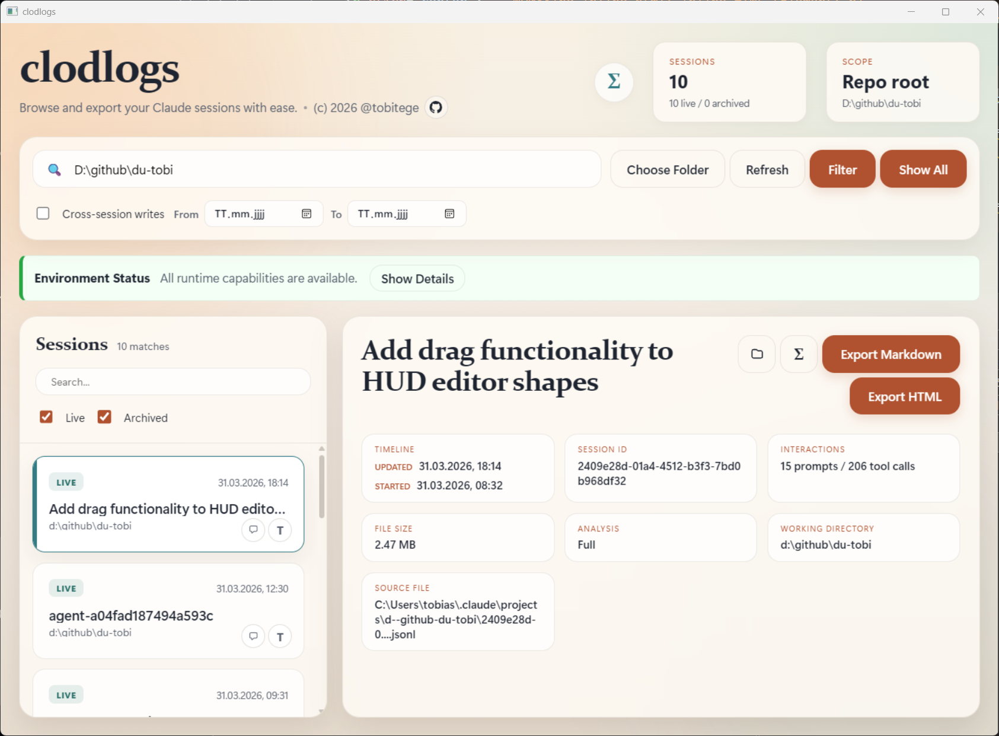
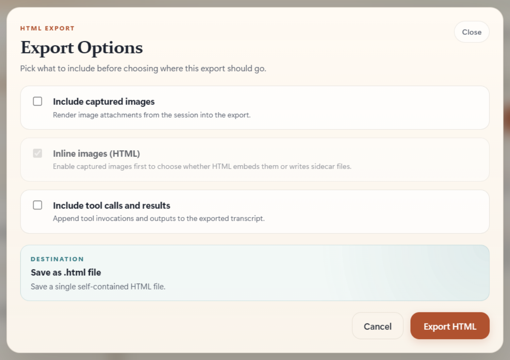
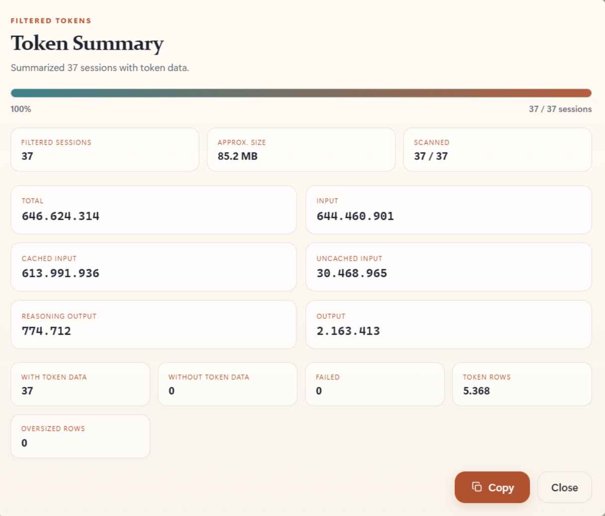

<p align="center">
  
</p>

<p align="center">
  
  
  
  
</p>

# clodlogs

`clodlogs` is a native Avalonia desktop app for browsing, replaying, analyzing, sanitizing, and exporting Claude Code session logs.

This is a port of my Codex logs tool "[codlogs](https://github.com/tobitege/codlogs)" with the same feature set, thus a low commit count for now.

Claude Code stores project logs under:

```text
%USERPROFILE%\.claude\projects\<sanitized-project-path>\*.jsonl
```

For example:

```text
C:\Users\[username]\.claude\projects\c--github-myrepo
```

<p align="center">
  
</p>

<p align="center">
  
</p>

## Desktop App

The desktop app uses [Avalonia](https://avaloniaui.net/) and targets .NET 10.

Prerequisites:

- Windows 10 or later
- .NET 10 SDK for local development
- Avalonia 12.1

Run it locally:

```powershell
dotnet run --project src\Clodlogs.Desktop\Clodlogs.Desktop.csproj
```

Other useful commands:

```powershell
dotnet build Clodlogs.sln -c Release
dotnet run --project src\Clodlogs.Desktop.Tests\Clodlogs.Desktop.Tests.csproj -c Release
dotnet publish src\Clodlogs.Desktop\Clodlogs.Desktop.csproj -c Release -r win-x64 --self-contained true -p:PublishSingleFile=true -p:PublishTrimmed=false
```

Current desktop app highlights:

- scans Claude project JSONL logs from `~/.claude/projects` or `%CLAUDE_HOME%\projects`
- filters by current folder tree or repo root and can include cross-session writes
- exports selected sessions to Markdown or HTML
- batch exports filtered sessions with collision-safe file naming
- summarizes Claude message usage for one selected session or all currently filtered sessions
- shows environment status for Claude home access, `git`, and `rg`
- opens a read-only full-window session replay dialog
- creates sanitized session copies with optional image and blob removal

## Large Session Handling

clodlogs is built to stay usable when a Claude session file becomes very large.

Current behavior:

- probes session file size without loading the whole file into memory
- uses bounded JSONL scanning for browsing and detail inspection
- skips automatic deep analysis for very large sessions to keep the UI responsive
- offers `Analyze Anyway` for a bounded manual scan when automatic analysis is skipped
- treats oversized JSONL rows as partial-analysis conditions instead of crashing normal inspection
- streams Markdown and HTML export so large session files do not require whole-file reads during export

## Changelog

### 1.0.3

- Added the native Avalonia Windows desktop app for browsing, replaying, analyzing, sanitizing, and exporting Claude sessions.
- Added collision-safe Markdown and HTML batch export for selected sessions from the filtered list.
- Added responsive, cancellable startup scanning with partial results and explicit completion status.
- Updated the Avalonia desktop packages to 12.1.1.

### 1.0.4

- Expanded token analysis with input, output, cache write, cache read, total-token, daily-usage, model, and estimated-cost breakdowns.
- Added refreshable Anthropic model pricing with separate 5-minute and 1-hour cache-write rates.
- Added PNG, CSV, and Markdown exports for token statistics.
